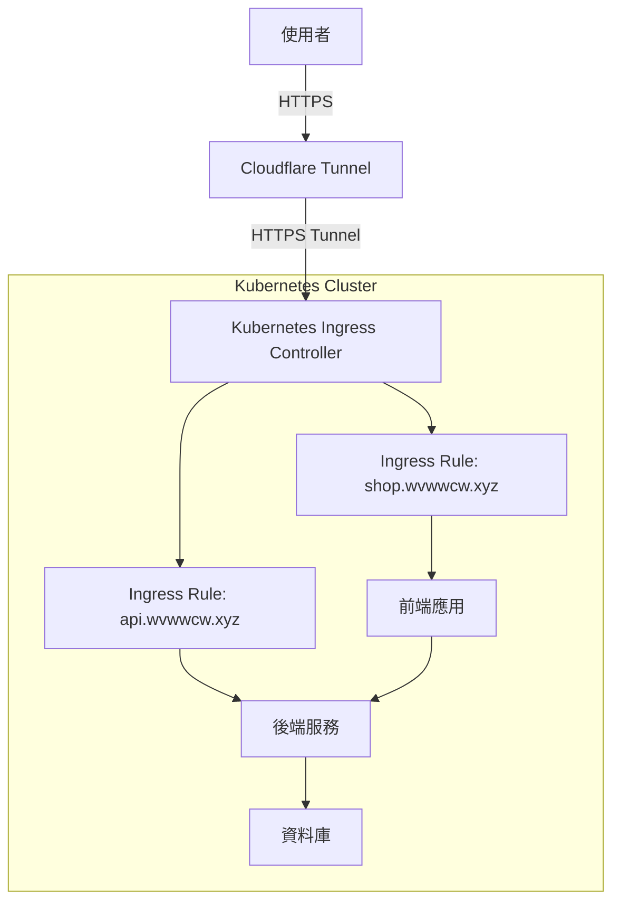

<pre> 
jp-shopping-site/
├── README.md                        ← 說明文件
├── clean_dockerhub_old_images.sh   ← Docker Hub 清理腳本
├── cloudflared-deployment.yaml     ← Cloudflare Tunnel 部署
├── frontend/                        ← 舊版 Nginx 前端部署
│   └── k8s/                         ← 前端對應 Kubernetes 設定
├── clevora-vue/                    ← 新版 Vue.js 前端 SPA 專案
│   └── src/                         ← Vue 應用主要程式碼
├── backend/                         ← FastAPI 後端專案
│   │── k8s/                         ← 後端對應 Kubernetes 設定    
│   └── app/                         ← FastAPI 主程式碼與模組
│       ├── routers/                ← 路由模組
│       ├── db/                     ← 資料庫操作模組
│       ├── utils/                  ← 工具函式
│       ├── services/               ← 業務邏輯模組
│       └── config.py               ← 環境變數設定
├── postgres/                        ← PostgreSQL 設定與部署
│   └── k8s/                         ← 資料庫對應 Kubernetes 設定
</pre>

## 專案結構說明

本專案包含前端、後端、資料庫、部署腳本以及相關的基礎設施配置。以下是主要的目錄和檔案說明：

### 根目錄 (jp-shopping-site/)
*   `README.md`: 本專案的說明文件，包含整體架構和各部分的詳細介紹。
*   `clean_dockerhub_old_images.sh`: 用於清理 Docker Hub 上舊有映像檔的腳本，有助於管理映像檔版本和儲存空間。
*   `cloudflared-deployment.yaml`: Cloudflare Tunnel 的 Kubernetes 部署配置檔，用於安全地將本地服務暴露到網際網路。
*   `package-lock.json`: 記錄了前端 `frontend/` 目錄下 Node.js 專案的確切依賴版本，確保團隊成員之間的依賴一致性。

### `backend/` - 後端應用程式
*   這是基於 Python FastAPI 框架開發的後端服務。
*   `Dockerfile`: 後端應用程式的 Dockerfile，定義了如何構建後端服務的 Docker 映像檔。
*   `app/`: 包含 FastAPI 應用程式的核心程式碼。
    *   `main.py`: 後端應用程式的入口點，定義了 FastAPI 實例和主要路由。
    *   `routers/`: 包含不同功能模組的路由定義（例如 `orders.py` 處理訂單相關 API，`pay.py` 處理支付邏輯，`admin.py` 處理管理員相關功能等）。
    *   `db/`: 包含資料庫連接和操作相關的程式碼（例如 `db.py` 負責資料庫連接池管理和游標獲取）。
    *   `config.py`: 應用程式的配置檔案。
    *   `requirements.txt`: 記錄了後端 Python 專案所需的所有依賴套件及其版本。
    *   `utils/`: 包含實用工具函數。
    *   `services/`: 包含各種服務邏輯。
*   `deploy_backend.sh`: 用於部署後端應用程式到 Kubernetes 的腳本。
*   `k8s/`: 包含後端服務的 Kubernetes 部署配置檔。
    *   `deployment.yaml`: 定義後端服務的 Pod 和容器部署。
    *   `ingress.yaml`: 定義 Kubernetes Ingress 規則，用於將外部流量路由到後端服務的 API 端點。
    *   `service.yaml`: 定義後端服務的 Kubernetes Service，用於集群內部服務發現和負載平衡。

### `clevora-vue/` - 前端 Vue.js 應用程式
*   這是基於 Vue.js 框架開發的單頁應用程式 (SPA)。
*   `Dockerfile`: 前端應用程式的 Dockerfile，定義了如何構建前端服務的 Docker 映像檔。
*   `src/`: 包含 Vue.js 應用程式的核心原始碼。
    *   `components/`: 包含可重用的 Vue 組件。
    *   `views/`: 包含應用程式的不同頁面組件（例如 `Home.vue`, `admin/Dashboard.vue`, `admin/Orders.vue` 等）。
    *   `stores/`: 包含 Vuex 或 Pinia 狀態管理模組（例如 `userStore`, `customerStore`）。
    *   `services/`: 包含與後端 API 互動的服務模組（例如 `api.js`）。
    *   `router.js`: Vue Router 的配置檔案，定義了前端路由規則。
    *   `main.js`: 應用程式的入口檔案，初始化 Vue 應用和插件。
    *   `App.vue`: 應用程式的根組件。
*   `vite.config.js`: Vite 打包工具的配置檔案。
*   `package.json`: 記錄了前端 Vue.js 專案的依賴和腳本資訊。
*   `package-lock.json`: 記錄了前端 Vue.js 專案的確切依賴版本。
*   `deploy_clevora-vue.sh`: 用於部署前端應用程式到 Kubernetes 的腳本。
*   `nginx.conf`: Nginx 的配置檔案，用於前端的靜態檔案服務和 API 請求轉發。

### `frontend/` - Nginx 靜態檔案服務 (舊版)
*   這個目錄可能包含一個獨立的 Nginx 服務，用於提供靜態檔案。如果 `clevora-vue` 目錄中的 `nginx.conf` 已經涵蓋了這部分功能，這個目錄是一個較舊的版本。
*   `Dockerfile`: Nginx 服務的 Dockerfile。old
*   `deploy_frontend.sh`: 部署前端 Nginx 服務的腳本。old
*   `html/`: 包含 Nginx 提供服務的靜態 HTML、CSS、JavaScript 檔案。old
*   `k8s/`: 包含前端 Nginx 服務的 Kubernetes 部署配置檔。
    *   `deployment.yaml`, `ingress.yaml`, `service.yaml`: 類似後端，用於部署和管理前端 Nginx 服務。

### `postgres/` - PostgreSQL 資料庫配置
*   這個目錄包含了 PostgreSQL 資料庫的相關配置和部署資訊。
*   `init.sql`: 包含資料庫初始化 SQL 語句，用於創建資料表和設定初始數據。
*   `k8s/`: 包含 PostgreSQL 資料庫的 Kubernetes 部署配置檔。
    *   `deployment.yaml`: 定義 PostgreSQL 資料庫的 Pod 和容器部署。
    *   `pvc.yaml`: 定義 Persistent Volume Claim，用於持久化存儲資料庫數據，防止 Pod 重啟後數據丟失。
    *   `secret.yaml`: 存儲敏感資訊（如資料庫密碼）的 Kubernetes Secret。
    *   `service.yaml`: 定義 PostgreSQL 資料庫的 Kubernetes Service，用於集群內部服務發現。

## 整體架構圖

### 圖例說明
*   **使用者 (User)**：最終使用者。
*   **CF Tunnel (Cloudflare Tunnel)**：Cloudflare 的安全隧道，將外部流量引入 Kubernetes 集群。
*   **Ingress (Kubernetes Ingress Controller)**：Kubernetes 入口控制器，負責將外部 HTTP/HTTPS 請求路由到集群內部的服務。
*   **Ingress Rule: shop.wvwwcw.xyz**：用於前端應用程式的 Ingress 規則。
*   **Ingress Rule: api.wvwwcw.xyz**：用於後端服務 API 的 Ingress 規則。
*   **前端應用 (clevora-vue Frontend / Nginx / Vue.js)**：基於 Vue.js 開發的單頁應用程式，透過 Nginx 服務。
*   **後端服務 (Backend / FastAPI Application)**：基於 Python FastAPI 框架開發的後端服務。
*   **資料庫 (PostgreSQL Database)**：PostgreSQL 資料庫，用於儲存所有應用程式資料。
