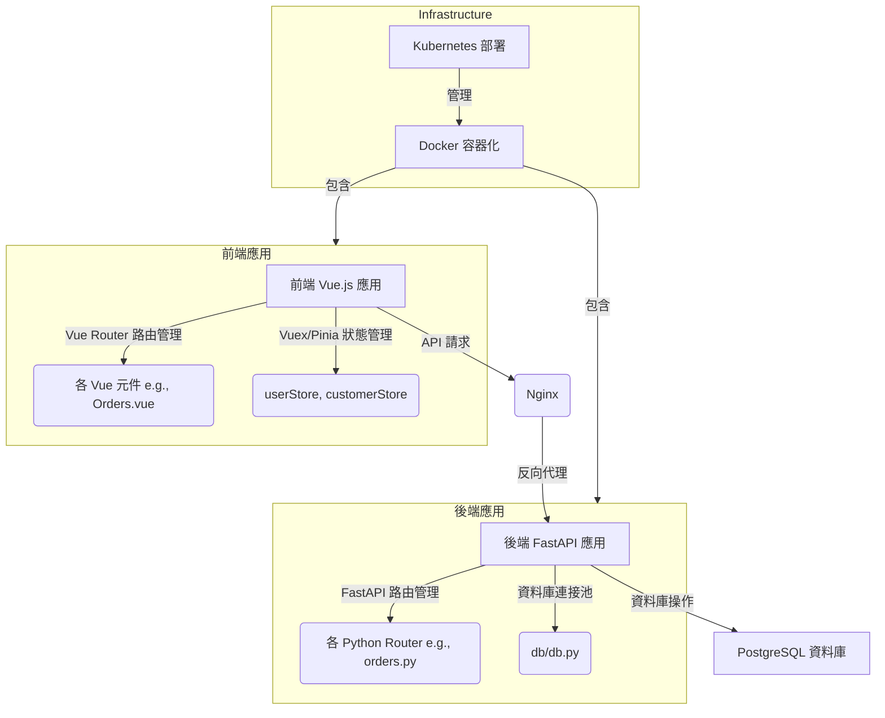

# Vue 3 + Vite

This template should help get you started developing with Vue 3 in Vite. The template uses Vue 3 `<script setup>` SFCs, check out the [script setup docs](https://v3.vuejs.org/api/sfc-script-setup.html#sfc-script-setup) to learn more.

Learn more about IDE Support for Vue in the [Vue Docs Scaling up Guide](https://vuejs.org/guide/scaling-up/tooling.html#ide-support).
<pre>
clevora-vue/
├── src/
│   ├── components/
│   │   └── admin/
│   │       ├── Login.vue
│   │       ├── Products.vue
│   │       └── Orders.vue
│   ├── views/
│   │   ├── Home.vue
│   │   └── admin/
│   │       └── Dashboard.vue
│   ├── stores/
│   │   └── auth.js
│   ├── services/
│   │   └── api.js
│   ├── router.js
│   ├── main.js
│   └── App.vue
</pre>

## 系統架構

以下是 Clevora 購物網站的整體系統架構圖及其詳細說明：

### 1. 前端應用 (clevora-vue)
*   **技術棧**: 主要使用 Vue.js 框架，搭配 Vite 進行快速開發和構建。
*   **路由管理**: 採用 Vue Router 進行頁面導航和管理。
*   **狀態管理**: 使用 Vuex 或 Pinia (根據專案實際情況，通常為 `userStore` 和 `customerStore`) 集中管理應用程式的狀態，包括用戶認證資訊、客戶數據等。
*   **UI/UX**: 負責提供使用者介面，包括商品列表、購物車、訂單歷史、管理員後台等功能。
*   **API 互動**: 通過 Axios 或其他 HTTP 客戶端與後端 FastAPI 應用進行數據交換。

### 2. 後端應用 (backend)
*   **技術棧**: 使用 Python 語言和 FastAPI 框架，提供高性能的 API 服務。
*   **路由處理**: 各個模組（例如 `orders.py`, `admin.py`, `customers.py`, `pay.py`）負責處理各自領域的 API 請求，例如訂單處理、用戶管理、支付接口等。
*   **資料庫互動**: 通過 `db/db.py` 模組管理資料庫連接，並執行 SQL 查詢（如透過 `get_db_cursor`）。
*   **認證與授權**: 包含處理用戶（包括管理員和客戶）認證和授權的邏輯（如 `verify_customer_jwt`）。
*   **業務邏輯**: 處理所有核心業務邏輯，如訂單創建、狀態更新、支付處理、庫存管理等。

### 3. Nginx
*   **角色**: 作為反向代理伺服器，負責將客戶端（瀏覽器）的請求轉發到正確的後端服務。
*   **前端服務**: 直接提供靜態的前端 Vue.js 應用程式檔案。
*   **API 轉發**: 將 `/api` 開頭的請求轉發到後端 FastAPI 應用。
*   **負載平衡**: 可以在多個後端實例之間分發請求，提高系統可用性和擴展性。

### 4. PostgreSQL 資料庫
*   **類型**: 關聯式資料庫系統。
*   **用途**: 用於持久化存儲所有應用程式數據，包括商品信息、訂單記錄、客戶資料、管理員帳戶、系統設定等。
*   **穩定性與可靠性**: 提供事務支持、數據完整性約束，確保數據的準確性和一致性。

### 5. 基礎設施 (Docker & Kubernetes)
*   **Docker 容器化**: 前端和後端應用程式都被打包成獨立的 Docker 容器。這確保了應用程式在不同環境下的一致性，簡化了部署流程。
*   **Kubernetes 部署**: 使用 Kubernetes (K8s) 作為容器編排平台，負責自動化部署、擴展和管理容器化應用程式。
*   **優勢**: 提供高可用性、彈性擴展、服務發現、負載平衡、自我修復等功能，確保系統在生產環境中的穩定運行。

